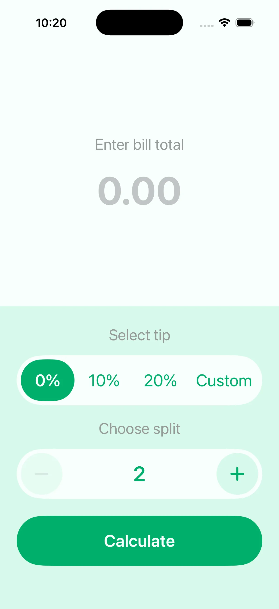

# Tipsy 💸

An iOS tip calculator. Enter a bill, pick a tip percentage, choose how many
people are splitting it, and see what each person owes.

<p align="center">
  
</p>

---

## 🧭 Features

* Bill entry with a decimal keypad that accepts either decimal separator
* Tip presets at 0%, 10%, and 20%, plus a custom percent typed in place
* Split between 2 and 25 people, stepped or typed
* Per person total written the way the reader's locale writes numbers
* Summary line naming the split and the tip that produced the total

---

## 🛠️ Tech Stack

* **Language:** Swift 6
* **UI:** SwiftUI
* **Platform:** iOS 18.0+
* **Architecture:** MV with pure services for arithmetic and formatting
* **Dependencies:** none

---

## 🚀 Setup

```bash
git config core.hooksPath .githooks   # enable swift-format pre-commit hook
open Tipsy.xcodeproj
```

Build and run from Xcode, or use the CLI helper:

```bash
scripts/xc.sh build   # build for the pinned simulator
scripts/xc.sh test    # run the unit tests
```

---

## 📦 About

A learning project rebuilt from the original UIKit storyboard version as a
SwiftUI app with a tested calculation layer.
